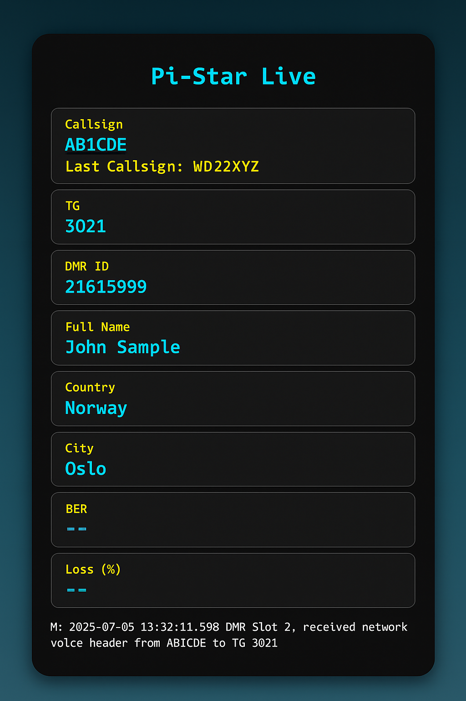

# Pi-Star Real-Time Interface by 4X5ZB

This project provides a mobile-friendly HTML interface for Pi-Star that displays **live DMR calls**, **callsign info**, **signal quality stats**, and the **last heard callsigns** in a retro-style design.

---

## 📦 Files Included

- `pi_star_interface_v5.html` — The main live display interface.
- `live_log.php` — A backend helper to stream logs.
- `preview.png` — A screenshot of the interface.

---

## 🚀 Installation Instructions

### 1. Requirements

- A working Pi-Star device with SSH enabled.
- [WinSCP](https://winscp.net/eng/download.php) for file transfer.
- SSH terminal access (e.g., via Windows CMD or PuTTY).

### 2. Steps

1. **Download the repository as a ZIP** and extract the contents.
2. **Open CMD** and connect to Pi-Star:
   ```bash
   ssh pi-star@pi-star.local
   ```
3. **Authenticate** (default password: `raspberry`)
4. **Enable write access**:
   ```bash
   rpi-rw
   ```
5. **Use WinSCP** to connect to `pi-star.local` via SCP, and upload:
   - `live_log.php`
   - `pi_star_interface_v5.html`
   into: `/home/pi-star/`
6. **Back in CMD**, move the files:
   ```bash
   sudo mv /home/pi-star/pi_star_interface_v5.html /var/www/dashboard/
   sudo mv /home/pi-star/live_log.php /var/www/dashboard/
   ```
7. **Access the interface** in your browser:
   ```
   http://pi-star.local/pi_star_interface_v5.html
   ```

---

## 📸 Interface Preview



---

## 📡 Created by: Kfir - 4X5ZB 🇮🇱

Feel free to connect via DMR or leave a comment!

## 📜 License

This project is open under the [MIT License](https://opensource.org/licenses/MIT).

## ☕ Support This Project

I’ve put a lot of time and passion into building this Pi-Star live interface for the ham radio community.  
If you found it useful and would like to support further development, consider buying me a coffee 💙

[](https://www.paypal.me/MonkeDeLofi)

